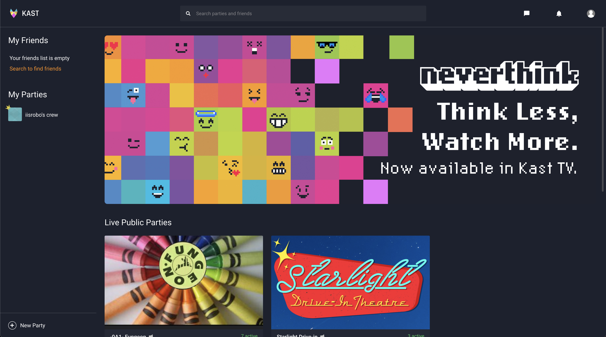
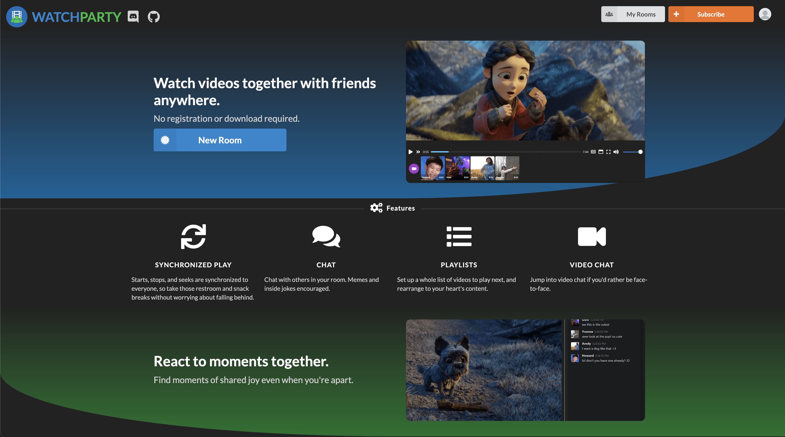
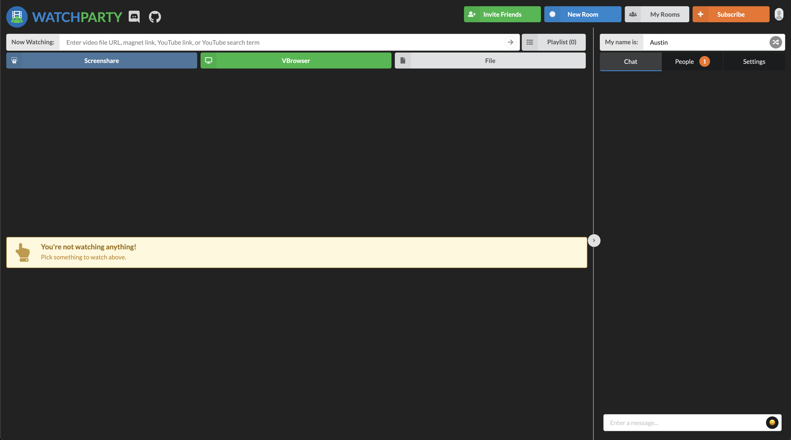

# Assignment #1

## Airwaves (tentative title)
### Austin Law, DH110

This project will attempt to create a smooth user experience for parallel video streaming, integrated with video call. This will emulate watching videos or movies with others in person, allowing people across the world to make as if they are together through the "airwaves".

## Heuristic Evaluation

I chose to evaluate [kastapp](https://www.kastapp.co/) and [watchparty](https://www.watchparty.me/).

### Kastapp

[Kastapp](https://www.kastapp.co/) is a website and desktop app used to host watch parties with friends online.
It currently only supports integration with Youtube, allowing users to watch Youtube videos at the same time. It also integrates the watch party with a video call, allowing users to see and speak with each other at the same time. Finally, it also has screen share, allowing users to do more specific things on their own machine if they don't want to watch Youtube videos.

Overall, I believe kastapp is quite nice, but its breadth of integration is lacking, and its Youtube integration is also missing features that I would expect.

### Watchparty

[Watchparty](https://www.watchparty.me/) is a website that allows people to view the same screen at the same time. It supports a "virtual browser," essentially creating a browser that everyone can control. In my opinion, this works better than normal screenshare, since everyone can control it and everyone will be synced (when a video is playing, under normal screen share the one sharing their screen will be slightly ahead of everyone else). However, if the users want, they can use screen sharing as well, which is also supported. Lastly, Watchparty supports uploading files to watch, so if a user has a video on their own machine, they could play that too.

However, Watchparty does not support video calls, so I believe the assumption is that users are using a different service to see/speak with each other. It also doesn't support integration with common services, such as Youtube.

Overall, I was happy to see the virtual browser aspect of Watchparty, but unfortunately it was quite slow. Outside of this feature, I believe more direct integration with common streaming services would be nice (the Youtube integration is passable for what Watchparty offers, but more direct integration woud provide a better experience).

### Detailed Analysis
| Heuristic | App #1 | Rating #1 | App #2 | Rating #2 |
|---|---|---|---|---|
| Visibility of system status | Was stuck in a loading screen with no indication of what was happening, or where I was directing to; had to reload the page to fix the issue; microphone has no indication if the user's audio is going through (compare to zoom, which has the microphone icon fill up and down if your audio is projecting) | 3 | Reasonably strong sense of system status, since the niche of the product is small: shows all information about just exactly what is provided (what is currently being watched, who is controlling, what is in the playlist) | 0 |
| Match between system and real world | The definition of the term "party" isn't immediately obvious | 1 | Generally, use is intuitive; however there is one search bar that attempts to work as two things, which isn't immediately obvious (searches by URL if you give a URL, or searches youtube if you give a search term) | 1 |
| User control and freedom | Requires premium subscription to access all features, while annoying to user, this is technically part of the business model so no real issue | 1 | Allows for a "virtual browser" (as opposed to just normal screen share) which essentially allows the user to do whatever they want, which is (in my opinion) a core feature lacking in kastapp. Also allows user to load their own files | 0 |
| Consistency and standards | Youtube does not have autoplay or suggestions (does not match the way actual Youtube work, which in my opinion is probably the most common use case of the app). Additionally, there is no back button to leave a party (there is a leave party button that emulates a leave call button, but I was personally expecting a back button to leave a party). | 2 | I have not seen other products like this, so I don't think there's a true "standard" (or at least I could not think of other services that work the same and would have other standards)  | 0 |
| Recognition rather than recall | Generally the function of most buttons and sections are obvious based on their design, although they don't have labels | 0 | Each button has a label that tells the user what it does | 0 |
| Error prevention | Ran into infinite loading issue (not sure what caused it) as well as many other loading and connection issues | 3 | While not directly an error, the virtual browser is quite slow connectivity wise. It took quite a long time to connect to Youtube, and streaming quality is relatively poor | 3 |
| Flexibility and efficiency of use | Only has a few options for built in browsing, anything other than Youtube would need to be screen shared. Additionally, the Youtube player doesn't support autoplay or adding videos to a queue. | 2 | While the "virtual browser" is exactly what I would want, I would also want integration with commonly used video sharing sites, such as Youtube or Netflix. For example, kastapp has integration with Youtube, allowing for a more smooth experience than the virtual browser would allow. Additionally, sites that are not Youtube do not work smoothly sharing by link. | 3 |
| Aesthetic and minimalist design | Generally, design is fine  | 0 | Generally, design is fine, just not super aesthetic | 1 |
| Help users with errors | Many connection and loading issues, but no indication of what is happening or what is causing it  | 3 | Again, did not run into any errors | 0 |
| Help and documentation | Same as above  | 3 | Same as above | 0 |