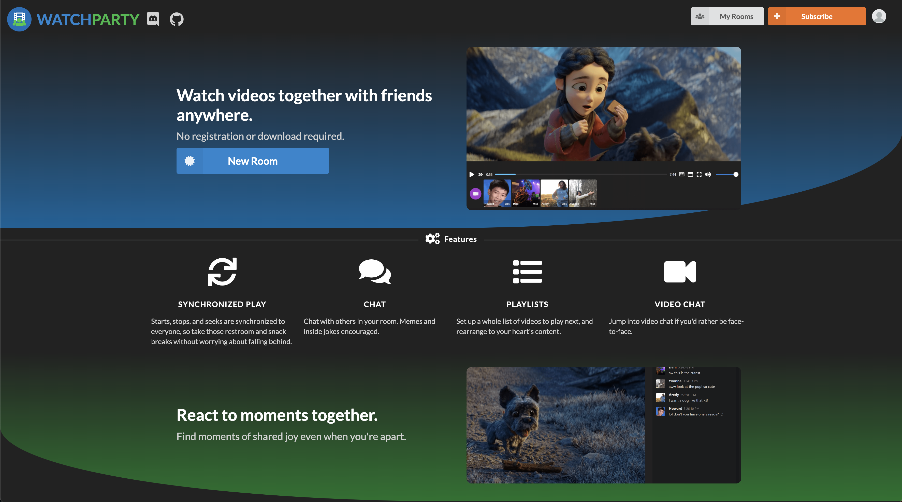

# Assignment #2

## Usability Testing

### Introduction

In this test, we tested the website [Watchparty.me](watchparty.me). This app is designed to allow users to watch Youtube videos together, as well as screen share and use a common virtual browser. It also lets them video call and chat at the same time. This is a task I commonly do with an app called Discord, but I hoped that dedicated apps and sites such as watchparty would have better integration, more fleshed out features, and more features. Watchparty only has Youtube integration, but it has interesting features such as file share and virtual browser.

### Metholodogy 

Specifically, I wanted to test how easy it is for a new user to do many of the common tasks core to the product. The first task is to create and share a new room, and change some of the settings. There are many buttons that in my opinion make it obvious how to do these tasks, so I believe this to be quite easy. The second task is to searching for and add Youtube videos to the playlist and skip around the playlist. I believe this is the hardest task; during my heuristic evaluation, I initially did not manage to use this feature properly on my first try. Finally, the third task is to use the unique VBrowser feature. Based on my heuristic evaluation, I believed that generally, most of my provided tasks should be relatively easy. The features themselves are not very complex, and accessing them should be relatively obvious due to the sparseness of the UI in general and the obviousness of the buttons.

### UT Materials
[Survey](https://docs.google.com/forms/d/e/1FAIpQLSdoz3fVlFlKLdh9Yd9VLxbYPnooPUT-BOWrKMT_Gduj96KGWw/viewform)

### Video
(Click to watch)

### Conclusion
In general, I was surprised about how the usability test went. My participant did struggle with the parts I thought she would, but specifically, I thought it was very interesting that she searched for completely alternative and unexpected routes to solve the task. I struggled briefly as the moderator in this sense, as I obviously didn't want to tell her the intended method but I also wanted to her to keep trying at the task. However, she did not really struggle with any other parts of the test, as I generally expected.

I also feel because of our personal relationship, I could have been more professional in general; however, I feel like this did not ultimately interfere with the usability test at all.

Also, I definitely think I could have prepared more for the test itself, especially since I feel that many unexpected things occurred. More specifically, I did not expect some things to be as hard as they were even though I knew they would happen. For example, I wasn't sure the best way to fill out the survey and conduct the test at the same time, so I opted to do the survey on my mobile device while my participant used the site on my computer. I also wasn't sure if some tasks could be considered completed given the way they were completed; if the participant does a task with an unintended method, is it still considered complete? I decided that yes, they should be considered complete, but I think in my survey I should have included a section for extra comments and nuance to be able to say that the participant did not use the intended method.

Finally, retrospectively, I feel as if I missed some parts of the website I would have like to test with my participant, but didn't think about it during the making of the UT materials.
