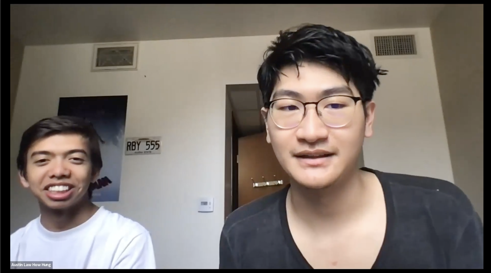

# Assignment #3

## Users in Context

### Introduction

In this study, I planned to study the main activity of a synced watchparty of various apps (namely a general browser, youtube, and netflix) with video call. The basic need fulfilled by this activity is the social need: love and belonging. Traditional solutions to conduct this activity is to use something like zoom or discord, a video call tool that allows screensharing for one person to share their screen, and it is what I expected my participant to default to when asked to do the activity. Common limitations of these methods are:
- limited interaction of the group (the rest of the people cannot directly interact with the screen/app of the one sharing)
- limited or no integration (i.e. discord has youtube integration but there are some limitations)

Some other limitations I thought of while planning for my interview are:
- what if the screen share does not work (i.e. Netflix does not allow screenshare by blacking out the screen if the user tries)
- what if the users don't have access to a device (for example, they are calling on the phone using something like Facetime and don't have a computer)

### Users
I believe anyone could be a target user for my projected app, but for the purposes of this study, I chose the target user to be primarily young adults: those with probably more energy and knowledge to want to watch things with friends, but also with less resources or availability to be able to be with each other in person. There should be no limitations to gender, interest, experience, etc. Users would do this activity as a recreational activity with friends (or family) that are not directly with them in person, to emulate being in person with them. Users would usually need to use two applications to do this activity: one to video call and screen share, and another app that contains the content they are watching together.

### Methodology 
To conduct my study, I actively interacted with a potential user, and asked them how they would try to watch do to a few tasks related to and including the activity in question. I decided to actively participate and interact because the activity by its nature requires multiple people. 
I asked the participant to assume I am not in person with them, even though in terms of the study I was.

### Script

Hi, thanks for coming in today.

[Ask who particpant is, how they are doing, how their quarter is going.]

In this study, I will be asking you to do a few things and seeing how you do them, and you can talk about what you are doing and why you are doing it. We also want to learn about your feelings about your process: what could be changed or what is good about it. 

[Task 1]

Specifically, we want to study how you would do watch parties with friends you are in video call with. Let's say you are on a video call with me, and we want to watch a Youtube video together. What would you do?

... conduct task, ask follow ups...

What is good or bad about the process that you are using?

[Task 2]

What if one of you doesn't have a device to watch on; for example, your friend is using their phone to FaceTime you and they don't have a computer.

... conduct task, ask follow ups...

What is good or bad about the process that you are using?

[Task 3]

Since YouTube is a common website people use, what if you wanted to watch something on a different site, for example Netflix (I happen to know that Netflix blocks screen sharing, which is why I ask this).

... conduct task, ask follow ups...

What is good or bad about the process that you are using?

### User Data

### _Video_

[Link to video recording](https://drive.google.com/file/d/1uPipNLyhCEoSCgH6i-R-K7STpqZzj1Kh/view?usp=sharing)

### _Transcript_

For the full transcript, see `transcript.vtt`. A summarized version of the first task is as follows:

> [Introduction]
> 
> Me: So today I'm basically just gonna ask you a questions on how you do a couple of things. The intent is basically get an idea of how you do things, where it could be improved, and what is good about basically the the manner in which you do it. Specifically, the activity that we're gonna be studying today is doing watch parties with people that are, not in with you in person, but you want to emulate the feeling of being together and watching something at the same time.
>
> Me: So to start us off, how would you watch a video together with someone, if you're on video.
>
> Participant: The normal thing to do, I guess if it's a YouTube video or something, then I would be on a video call like this and I would screen share like this more or less... yeah, it would just be, you know, on a video call with them like this, and then share the screen, and that would be about it.
>
> Me: So we're using Zoom to record this, would Zoom be something you would use?
>
> Participant: Yeah, either Zoom or Discord usually among friends.
>
> Me: What are some things that you think are nice about [the screen sharing] or what do you think could be improved?
> 
> Participant: I mean, I'd say, probably the biggest problem is lag, because oftentimes, especially if you're on slower Internet, which I often am, then I'm downloading the video and then essentially uploading the video at the same time to to the other person. So oftentimes it will lag out on their side, or they can't hear it, and especially issues like audio, sometimes breaks. If I talk, then the video stops playing audio or something, and they can't hear what's going on.
>
> Me: And what would you say is, I don't know if benefits is the right word, but what is nice about screen share?
>
> Participant: It's already in the app that I'm using. I've done it before.

The other tasks in the interview followed similarly: I asked them to do a task, asked follow ups and asked about pros and cons.

### Reflections

### _Insights from the data_

I would say the main thing I learned from this interview was that people use screen sharing as a tool for watchparties because it is something that other apps already have and something they are comfortable with. I happen to know that Discord, a common video call app, has YouTube integration, but my participant mentioned that he does not use it because he did not know of its existence. Another thing I learned is that to have watch parties, apps need to somehow integrate video calls directly with the watch party itself; otherwise, people resort to convoluted methods such as directly videoing the content they want to watch. Finally, one complaint about watchparties is that often (when screen sharing), poor internet connection results in a poor experience for everyone (except the one screen sharing), since the video will lag or audio will be lost.

### _Insights about the interview itself_

One thing I would change about my interview is the tasks that I gave (or how I asked them). Whether it was because the tasks were too simple, not general enough, etc., the interview took much shorter than expected (8 minutes against the projected 15). I also think that in the moment, I forgot to do some of the introductory stuff, such as introduce myself, which did not help with the time issue. I felt that I did a decent job asking follow up questions as the participant did the task, but think there is still improvement to be done there.

