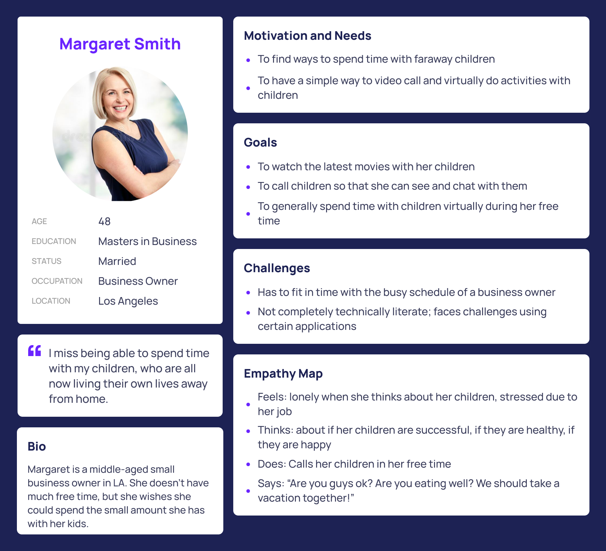
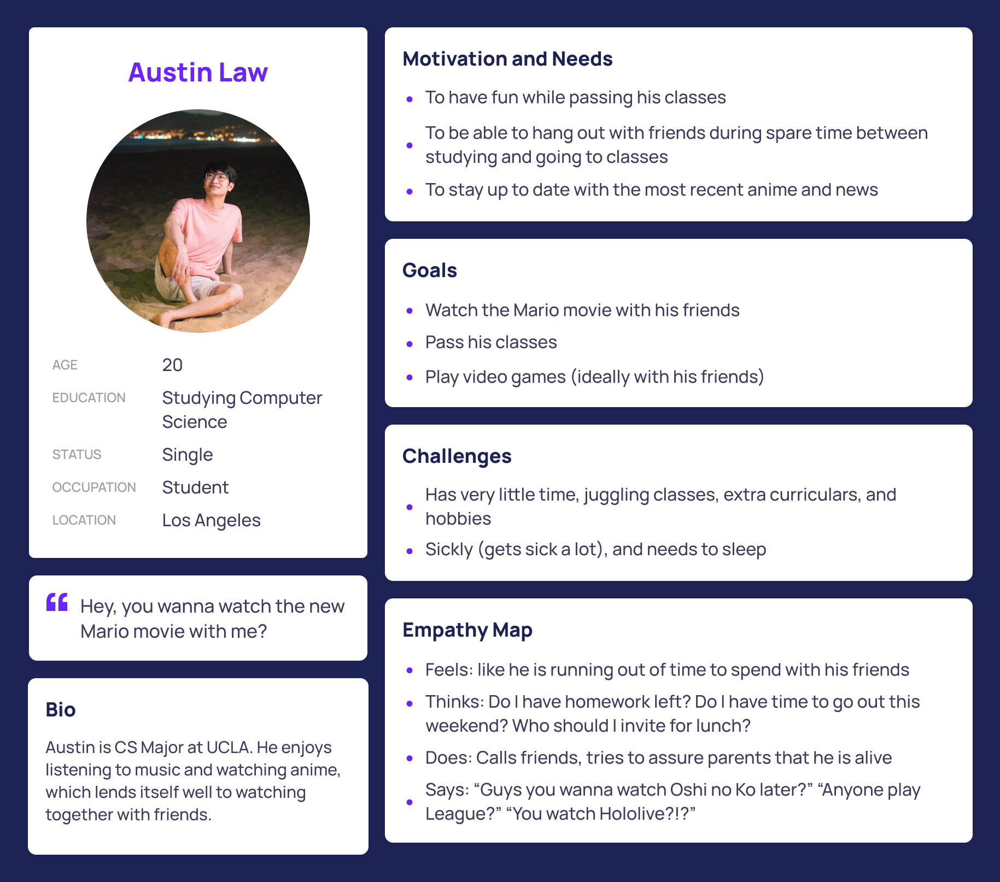

# Assignment #4

## UX Storytelling

The purpose of UX storytelling is to gain a better understanding of your users, what they goals are, and why they are using your product. In this way, you gain insight into how to build and design your product such that they want to use it, and use it to solve their problems without any frustration.

The two tasks we will examine with the personas and journey maps are similar but not exactly the same. They both fall under the general description of "watching videos together while on video call." However, one is watching a TV show on a popular website, while one is watching an anime on a more esoteric website.
## Personas and Empathy Maps

### Persona #1: Margaret Smith - business owner and mother of two

### Persona #2: Austin Law - graduating college student

## Scenarios and Journey Maps

### Persona #1: Margaret Smith

After a long day at work, Margaret wants to video call her kids to catch up and spend time with them. She also wants to do some activity with them, as a way to relax after the stress of the day: to this end, she would like to watch TV with them. This TV show is streamed online, on a popular website. However, she does not have too much time to try to set something major up; she returns home late and has to sleep early to leave in the morning. She would also like this to be some weekly event for the family, so the experience should not be difficult to set up every week. In any case, she has found herself in the past often struggling to learn how to use new apps or technological, so the app should be as streamlined as possible. In the past, she has used Zoom screen sharing, but has found occasional difficulty using the interface, as well as often runs into connectivity issues while streaming.

Margaret's Journey Map:

### Persona #2: Austin Law

It's 11 PM at night, and Austin and his friends are online playing League of Legends. After a few games, they want to watch the latest hit anime, Oshi no Ko. Since this anime is not on many common sites (namely YouTube), they have to use a random website online to watch it. They use Discord to call each other, and have someone screen share. However, due to the latency associated with screen share, their watching experience is not synced, and often they run into issues with audio or video. Also, whoever is screen sharing can not multitask, and do homework at the same time as watching, because their screen is being used to stream the video.

Austin's Journey Map:

