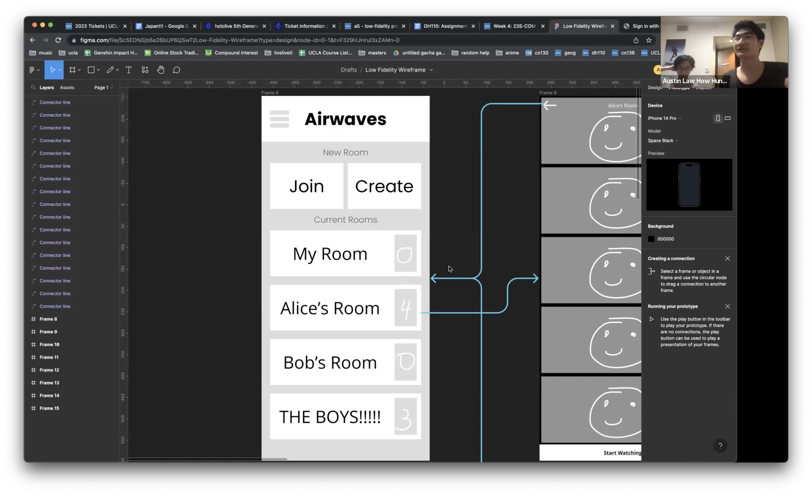
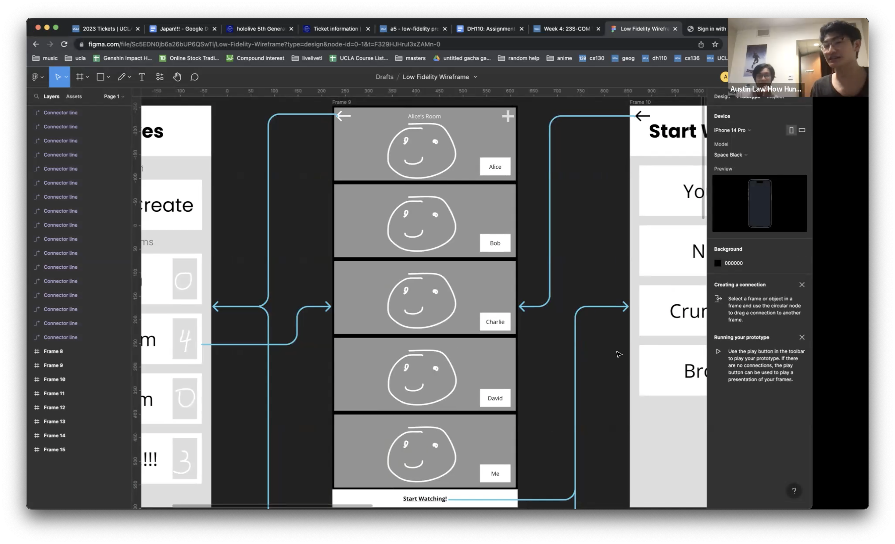
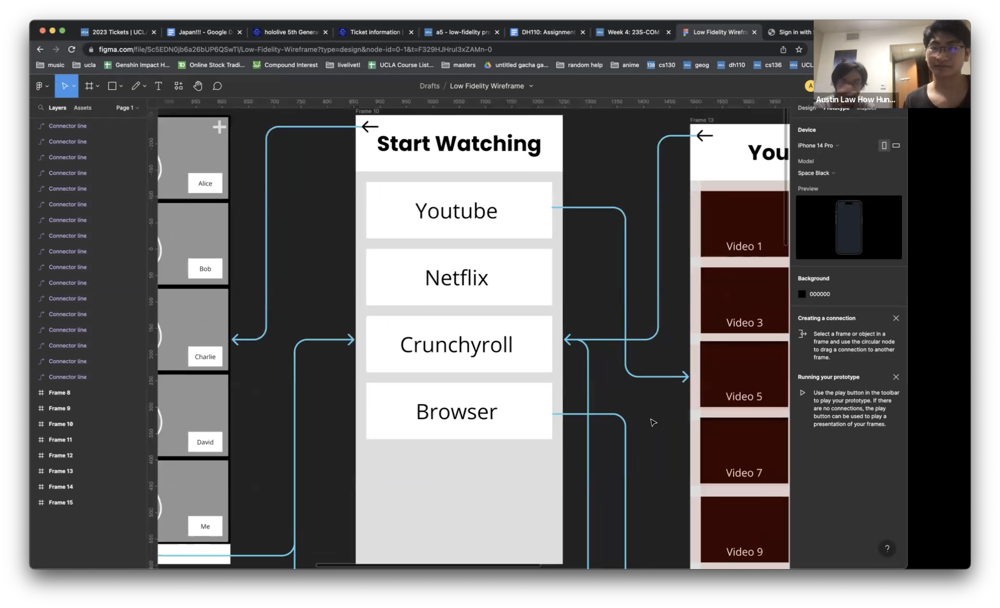
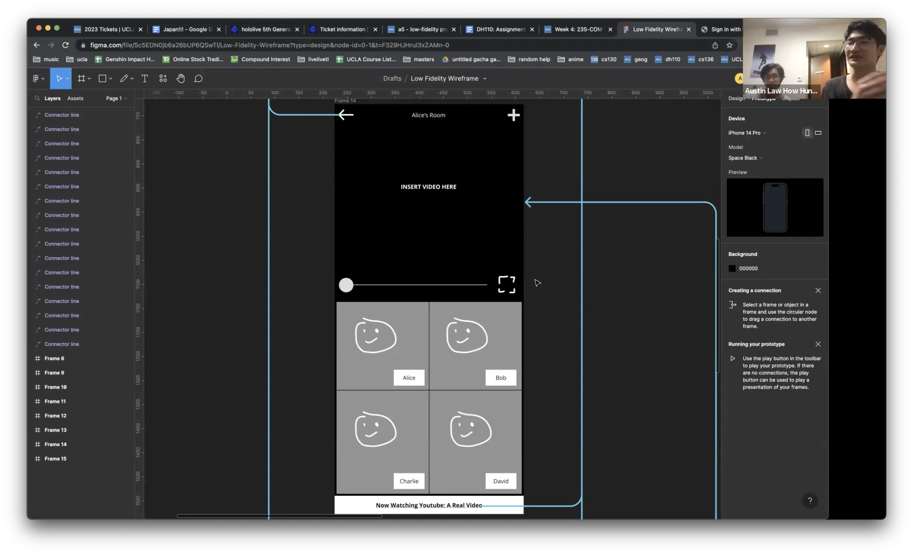
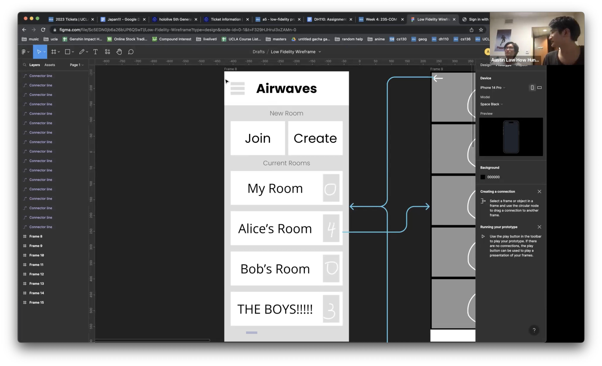
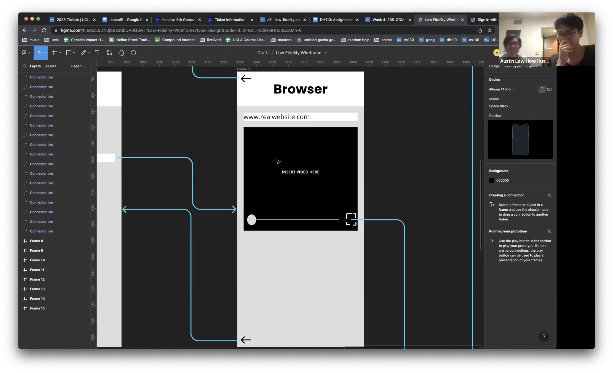

# Assignment #5

## Low Fidelity Prototype

### Wireframes and Wireflows

### Tasks

The two tasks I asked my participant to complete were as follows:

1. Join a room (Alice's room) and start watching a YouTube video.
2. Afterwards, imagine you and your friends finish the YouTube video, and want to watch something on a completely different site. Set up the watchparty for a video on a different site.

### Testing and Screenshots

My partcipant was able to successfully complete the first task. However, he ended up being quite confused when trying to complete the second task, which showed me many opportunities for improvement in my design. For the full video, see [this link](https://drive.google.com/file/d/1cefo-LlnKzvraQTdUNtP-W9StXErEUvB/view?usp=share_link).

Some screenshots from the testing:

First Task:

In the first task, my participant successfully navigated accross the screens to watch a YouTube video. He did mention that at the very beginning, his intuition was to use a different button than intended to join a room (clicking "Join" instead of 
Alice's Room").

Second Task:

In the second task, my user showed a lot of confusion; he did not realize that the same button he used earlier to "Start Watching" was the same button that needed to be pressed to navigate to the browser. Also, once he reached the browser with the video, he was confused on how to actually share this video (he mentioned that he expected a button that might say something like "start streaming").

### Reflection

The testing process was very enlightening in terms of what improvements could be made. My participant struggled with both things that I expected him to struggle with, as well as things I did not expect him to struggle with. For example, I was unsure what the interface for the browser video should like (the final screenshot). As I somewhat expected, my participant faced confusion at this part of the wireflow. However, what was the most helpful is that he mentioned briefly what he would have expected to see (a button saying to "start stream".)

I was surprised at the very beginning when my partipant mentioned that his immediate intuition was to click "Join" as opposed to "Alice's Room". I'm not sure if that is because of my explanation of the task (I don't think I specifically said to join Alice's room) or because of the design itself. During the design process, I thought that this exact problem might occur, which is why I added the headers for "New Room" and "Current Rooms" in the initial start screen.

Overall, I think the testing process when quite smoothly. During the tasks, my user did a great job describing his own thoughts, which really helped my understanding of how a new user feels using this design, and ways I could make certain things more obvious.