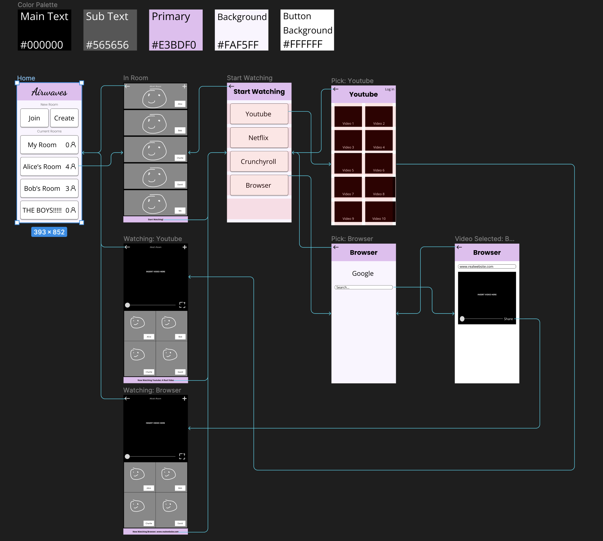
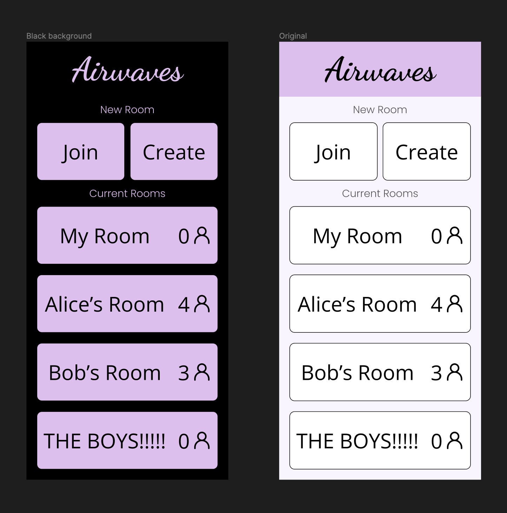
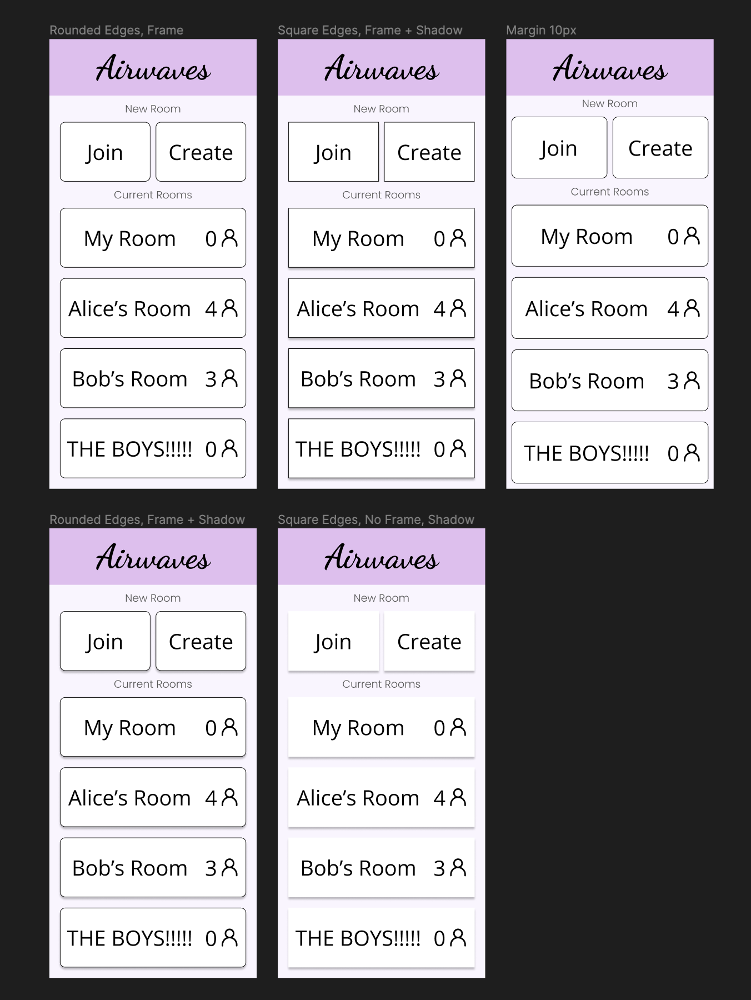

# Assignment #6 

## Interface Design

### Airwaves

My project is a watch party app, allowing users to video call and watch videos together at the same time. The purpose of the interface design is to create an experience for users that is smooth and obvious. In other words, users should be able to quickly understand and use my app. To achieve my interface design, I had some initial idea of what I wanted, and tested various colors, fonts, and shapes. I also implemented some of the more pressing pieces of advice I received from my user testing.

### Wireflow

For the full wireflow and testing pages, see [this link](https://www.figma.com/file/TRpSUOUu8gyGXevypSxyMN/Interface-Design?type=design&node-id=10%3A437&t=6j3j6UsJ7Jkz1glC-1).

### Testing: Typography
[Typography Testing Page](https://www.figma.com/file/TRpSUOUu8gyGXevypSxyMN/Interface-Design?type=design&node-id=105%3A104&t=ID2wCQVx9fkp0cTI-1)

I tested a few different sets of fonts. I knew that I wanted a "header" font and a "main" font, so I tested in pairs of two.

Ultimately, I ended up using Poppins for the headers and Open Sans for main text. However, for specifically the name of the app in the home page, I liked the idea of using a cursive font, so I used Dancing Script for that.

### Testing: Color
[Color Testing Page](https://www.figma.com/file/TRpSUOUu8ghttps://www.figma.com/file/TRpSUOUu8gyGXevypSxyMN/Interface-Design?type=design&node-id=106%3A74&t=ID2wCQVx9fkp0cTI-1)

My favorite color is lavender, so it felt natural to use some sort of lavender color as the primary color. I also did not want to use straight white (#ffffff) as the primary background color, so I used an off-white color that is shaded slightly purple. I tested the colors in both dark mode and light mode, and found the shading to be quite pleasant in both. Additionally, both passed the A11y contrast check.

### Testing: Shape
[Shape Testing Page](https://www.figma.com/file/TRpSUOUu8gyGXevypSxyMN/Interface-Design?type=design&node-id=107%3A333&t=ID2wCQVx9fkp0cTI-1)

Here, I mainly experimented with square or rounded buttons. I also played with having shadows for the buttons, and messed a little with the margins.

Ultimately, I chose to use rounded edges, a frame, and drop shadow for the buttons. Most "modern" designs tend to use rounded edges, so it felt quite natural to use them, and I personally like having frames around buttons. I also liked the sense of depth the drop shadow added, making it feel more like the buttons are three-dimensional and popping out of the screen.

### Impression Test

I ran a quick few minutes interview with the same tester I interviewed for the prototype test: a few quotes (paraphrased) from our conversation

> Q: Is the meaning of the icon of the person obvious?
> 
> A: Adding the image to represent the person definitely made it more clear what the number meant.
 
> Q: What do you think about the color scheme?
>
> A: I like the purple, it's calming.

> Q: How about the contrast between the colors and the text?
>
> A: Nothing is illegible.

> "I see you fixed some of stuff I said from last time."

Overall, my tester liked styling of the design: the colors, fonts, and shapes all received their stamp of approval.

However, they still had some carry-over questions about the design that I didn't change: namely, the Join/Create buttons and their use with relation to making rooms. However, upon further inquiry, I realized the confusion came from a fundamental misunderstanding of the way the app would work. My tester thought that rooms would be temporarily made (and used once), while I intended for rooms to be permanently alive, whether active or not. Thus, I'm not sure if this is an issue with my design, or if the confusion came from a misunderstanding of how the app would work. Other than that, I generally used the results of my previous testing to improve a few small things about the design, which my tester approved of this time around.

Overall, I think the visual aspects of the design were well recieved: colors, font, and shapes are fine. However, there are still some general questions about the design that could be improved: I added a "Share" button in the "Video Selected: Browser" frame, but my tester still found some issue with this, saying that it should probably not be embedded into the video itself. 