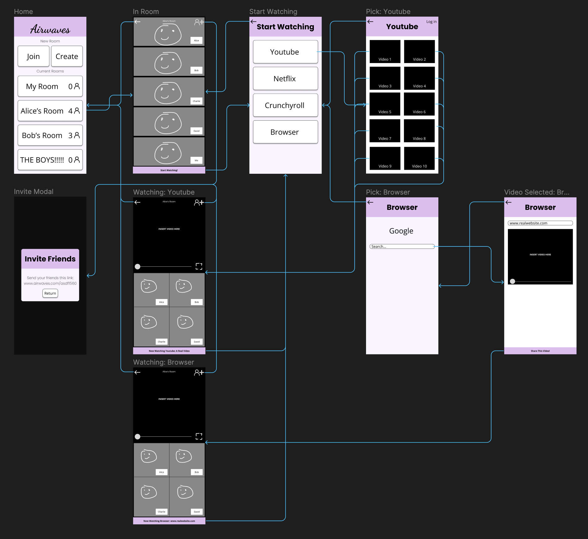

# Assignment #7

## High Fidelity Prototype

### Airwaves

My project is a watch party app, allowing users to video call and watch videos together at the same time. The purpose of the interactive prototype phase is to link the wireflows created in the previous step such that users can navigate the app easily and smoothly. In other words, users should be able to understand or at least presume what buttons will lead to what wireframes every step of the way. To create my interactive prototype, I built upon the wireflow created previously, and implemented the navigation functionality of various buttons. Additionally, I added a few new things and made a few changes in response to the feedback from my previous tester.

### Currently Supported Tasks

- Join a (specific) room.
- (Make believe) invite a friend
- Watch a Youtube video
- Watch a video by searching on a browser
- Navigate back from each window

### Full Wireflow

### Interactive Prototype

To see the interactive prototype, use the link [here](https://www.figma.com/proto/TRpSUOUu8gyGXevypSxyMN/Interface-Design?type=design&node-id=123-299&scaling=scale-down&page-id=123%3A90&starting-point-node-id=123%3A299).

### Cognitive Walkthrough

For my cognitive walkthrough, I asked my tester to conduct each supported task above. The two primary tasks I wanted to focus on were:
- Invite a friend
- Watch a Youtube video, and then watch a video in the browser.

> Q: First impressions?
> A: "I think looks pretty clean, the Join and Create buttons are obvious, and the rooms as well. It's obvious that Alice's room has four people."

> Q: For your first task, can you join Alice's room and (make as if) you are inviting a friend.
> Tester managed to immediately finish this task; found the "invite" button very easily.

> Q: So this app is supposed to help you do watchparties with your friends. Lets say you and your friends want to watch a Youtube video. Can you start watching a Youtube video?
> Tester briefly took a moment to find the "Start Watching" button; after this, they managed to quickly finish the rest of this task (followed the rest of the buttons easily).

> Q: Now let's say you finished the Youtube video, or you want to watch a video on the Internet. Try to search a video to watch.
> Tester struggled to figure out how to switch from Youtube -> Browser (they did not realize that they had to press the same button as before, and tried pressing the back button).
> Once they managed to navigate to the "Video Selected: Browser" frame, they struggled again to get to the next step and actually share the video.

After the cognitive walkthrough, I asked my tester for some feedback on what they think should be changed to improve the design of the site. Reflection is found below.

### Reflection

There were two main takeaways from my cognitive testing. First, the start watching button (at the bottom of the screen) should be larger, to draw more attention to it. My tester initially did not see it when trying to do the "watch a Youtube video" task, and again when trying to watch a video from the browser. The second take away was that the back arrow should be a "Leave" button while in the room window. My tester repeatedly assumed that the back button while in the room would take them back one window (i.e. from the room to the Start Watching page), and then it would instead return them back to the home page. After the test, they said that it would be more obvious if it was a text button that said "Leave".

### Past Versions and Changes

Some of the changes I made in past versions include:

- Adding the "invite" modal.
    - I wanted to add the functionality to add friends, so I designed and implemented the invite modal.
- Changed the "invite" button from just a plus sign to a plus sign with a person icon.
    - Based on my previous testing, I thought that the plus sign wasn't fully obvious, so I added the person icon as well.
- Moved around the "share" button in the "Video Selected: Browser" frame.
    - This specifically has been a repeated issue, in which it isn't obvious what how to share a video from the browser once it was selected. I experimented with a few options as I designed the app, included having a Share button within the video and having a Share Video footer.
